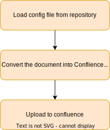
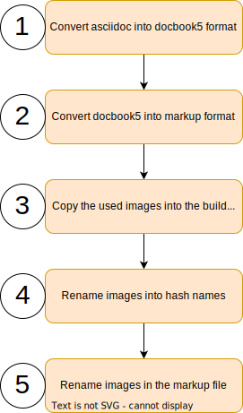
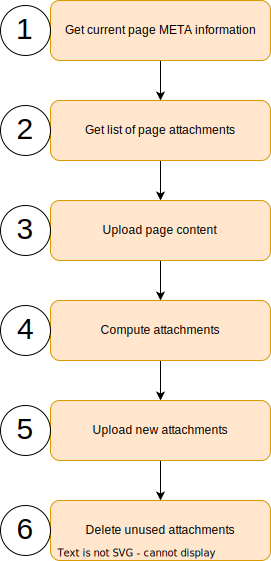

@onrunning/cil-logistics-action-upload-document-to-confluence / [Exports](docApi/modules.md)

# doc processor

This processor compiles Asscidoc documents in a markdown format which is
understand by confluence. Then the created document is uploaded to
confluence. Afterwards the images used in the document are uploaded as
attachments.

## Documentation upload action

This action uploads asciidoc documentationfrom the repository into
confluence. To make the action run pandoc is needed.

### Configuration file

The repository which provides the documentation to be uploaded must have
a configuration file. This file defines which asciidoc document should
be uploaded and where.

**example config**

    [
        {                                  
            "fileName": "doc/index.adoc",  
            "dev": {                       
                "pageId": "1992491009"     
            },
            "uat": {
                "pageId": "1992491234"
            },
            "prd": {
                "pageId": "1998356485"
            }
        }
    ]

-   The configuration file could hold different configurations for
    multiple files. Also the same file could be published to different
    locations.

-   The documentation file which should be uploaded.

-   It is possible to defined different stages. So with each stage it
    could be deployed to different locations in confluence. So the
    documentation could be checked before it is deployed to the
    production location.

-   The page in confluence needs to be created manually upfront. Then
    the upload will update the page each time. This allows the user to
    use the full confluence functionality for page orchestration.

### Example of a Github workflow action

Place the code in a 'xyz.yml' file in your '.github/workflows' folder.

    name: Upload Documentation to Confluence
    on:
      push:
        branches:
          - main
    jobs:
      upload:
        runs-on: ubuntu-latest
        steps:
          - uses: actions/checkout@v3             
          - uses: onrunning/cil-logistics-action-upload-doc-to-confluence@main 
            with:
              confluence_user: 'myUserName'       
              confluence_password: 'mySecret'     
              target: 'dev'                       
              config_file: 'doc/config.json'      
              build_directory: 'buildDoc'         

-   This checks out the repository.

-   The call of the documentation action.

-   The user to connect to confluence.

-   The password for the user.

-   The target (dev|uat|prd).

-   The configuration file as described above.

-   A name for a temporary directory to build the documentation in.

# The main program low

The processor needs to know which asciidoc file should be processed.
Also the location in confluence where to publish the genrated document.
This information is stored in a config file.

1.  Load the config file  
    Loads the config file from the repository.

2.  Convert document  
    Converts the document in a markup format confluence understands.

3.  Upload document to confluence  
    Uploads the document and the images.

# Convert document

Confluence has its own marupo language. So the document needs to be
converted into this format before it could be uploaded.

Images in confluence are handled as attachments and refrenced a local
files. All the attachemnts in confluence are in the same folder. So the
converter needs to ensure that all the images have a unique name. To not
flood confluence with new images for each upload the processor needs to
keep trag of the generated names. Also unused images should be deleted
from confluence.

1.  Convert asciidoc into docbook  
    Uses Asciidoctor to compile a docbook5 xml file from the asciidoctor
    files. It is not possible to create the markup directly from
    asciidoc.

2.  Convert docbook5 to Confluence markup  
    For this step pandoc is used. Pandoc is a very powerfu document
    converter. It is able to convert between many formats.

3.  Copy image files  
    The handling of the images is not so easy. The images needs manually
    be copied from the images folder in the doc directory into the build
    directory of this process.

4.  Rename image files  
    As mentioned earlier the files in confluence are stored flat in one
    folder as attachments. So the process needs to ensusre that files
    from different directories with the same name have unique names.
    Also there must be a way of housekeeping these files in Confluence.

    To archive these goals all the files get a prefix
    'CIL\_CONVERTER\_'. This prefix allows the process to distinguish
    files comming from the process and files uploaded manually.

    To make the file names unique the process creates the hash value of
    the file content and renames it. So the file namen
    'images/subDir/someImage.svg' will be renamed in
    'CIL\_CONVERTER\_0b1cca5ed879a5c1e4377281a8121027.svg'.

    This also has the advantage that images used multiple times needs
    only be uploaded once.

5.  Rename imgaes in the markup file  
    After renaming the image files, the references in the markup needs
    to be renamed also.

# Upload document to confluence

Uploads the genrated document and all the needed images.

1.  Get the current page META information  
    When uploading a page to confluence the title of the page and a new
    consecutive version number must be given. To get this information
    the first step is to download these informations from the existing
    page.

2.  Get a list of the current existing attachments  
    Download the meta information of all the exiting attachments.

3.  Upload the new page content  
    Uploads the new page content. The version number is incremented by
    one.

4.  Compute attachments  
    Compares the list of exiting attachments with the list of used
    attachments in the current document. It creates two results.

    A list with the new attachments which needs to be uploaded. A new
    attachent could also be an image which has changed. As we use the
    hash value as the file name, every time a image changes a new file
    name is created.

    A list of attachments which are not used any more.

5.  Upload new attachments  
    Uploads all the new attachments to confluence.

6.  Delete unused attachments  
    Deletes the attachments from confluence which are not used any more.
