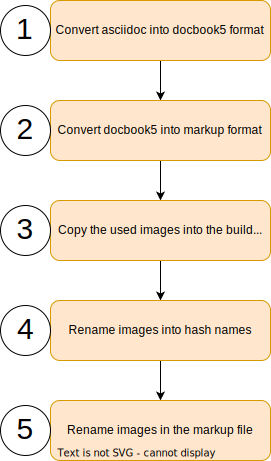

== Convert document
Confluence has its own markup language. So the document needs to be converted into
this format before it could be uploaded.

Images in confluence are handled as attachments and refrenced a local files.
All the attachments in confluence are in the same folder. So the converter needs to ensure
that all the images have a unique name. To not flood confluence with new images
for each upload the processor needs to keep trag of the generated names. Also unused images
should be deleted from confluence.

. Convert asciidoc into docbook +
Uses Asciidoctor to compile a docbook5 xml file from the asciidoctor files.
It is not possible to create the markup directly from asciidoc.

. Convert docbook5 to Confluence markup +
For this step pandoc is used. Pandoc is a very powerful document converter.
It is able to convert between many formats.

. Copy image files +
The handling of the images is not so easy. The images needs manually be copied from
the images folder in the doc directory into the build directory of this process.

. Rename image files +
As mentioned earlier the files in confluence are stored flat in one folder as attachments.
So the process needs to ensusre that files from different directories with the same name have unique
names. Also there must be a way of housekeeping these files in Confluence.
+
To archive these goals all the files get a prefix 'CIL_CONVERTER_'. This prefix allows the process to distinguish files comming from the process and files uploaded manually.
+
To make the file names unique the process creates the hash value of the file content and renames it.
So the file namen 'images/subDir/someImage.svg' will be renamed in 'CIL_CONVERTER_0b1cca5ed879a5c1e4377281a8121027.svg'.
+
This also has the advantage that images used multiple times needs only be uploaded once.

. Rename imgaes in the markup file +
  After renaming the image files, the references in the markup needs to be renamed also.
