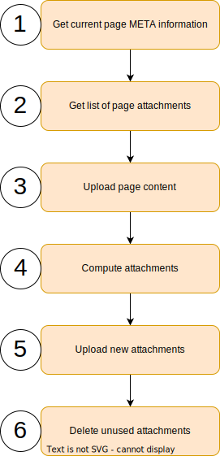

== Upload document to confluence
Uploads the generated document and all the needed images.

. Get the current page META information +
When uploading a page to confluence the title of the page and a new consecutive version number
must be given. To get this information the first step is to download this information
from the existing page.

. Get a list of the current existing attachments +
Download the meta information of all the exiting attachments.

. Upload the new page content +
Uploads the new page content. The version number is incremented by one.

. Compute attachments +
Compares the list of exiting attachments with the list of used attachments in the current document.
It creates two results.
+
A list with the new attachments which needs to be uploaded. A new attachment could also be an image which has changed.
As we use the hash value as the file name, every time an image changes a new file name is created.
+
A list of attachments which are not used anymore.

. Upload new attachments +
Uploads all the new attachments to confluence.

. Delete unused attachments +
Deletes the attachments from confluence which are not used anymore.

